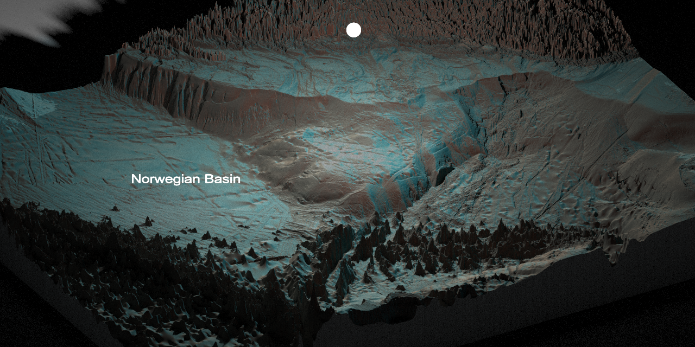

# MA.NorwegianBasin

This repository houses the code for parameterising the end to end
ecosystem model strathE2E for the Norwegian Basin (From the shore to 
the Mid-Atlantic Ridge). Scripts are loosely classified into families
-*bathymetry*-*fish*-*flows*-*nemo-medusa*-*saltless*-*StrathE2E*. R scripts
and Figures are self-explanatory directories.

This work is part of Mission Atlantic. Other Mission Atlantic (MA.) 
repositories cover StrathE2E parameterisations for other geographical areas.
The in house R packages used for these projects (*MiMeMo.tools*, *nemomedusR*, *slabR*)
were developed under the MiMeMo project. 
